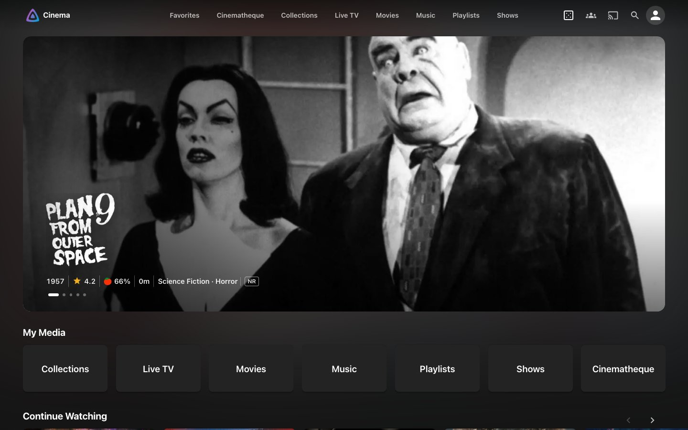
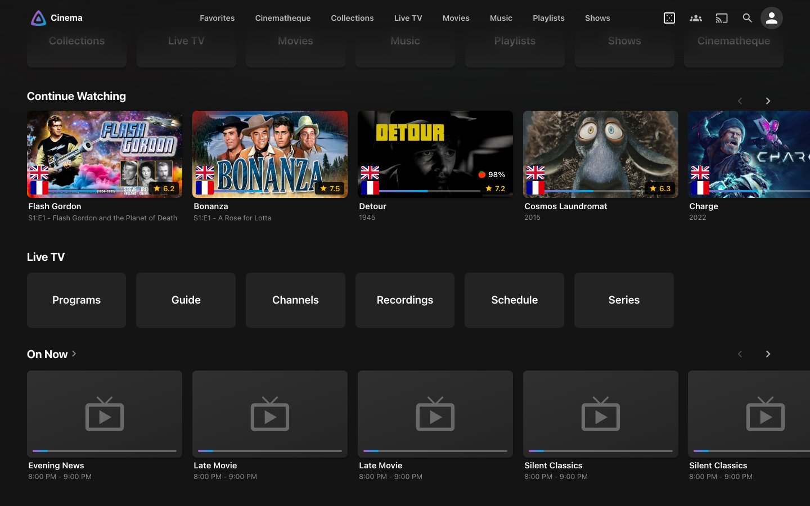
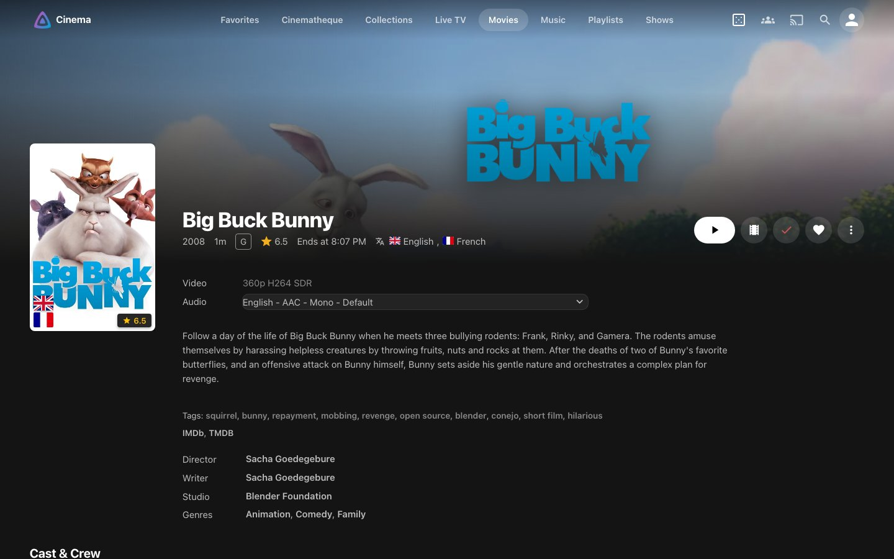
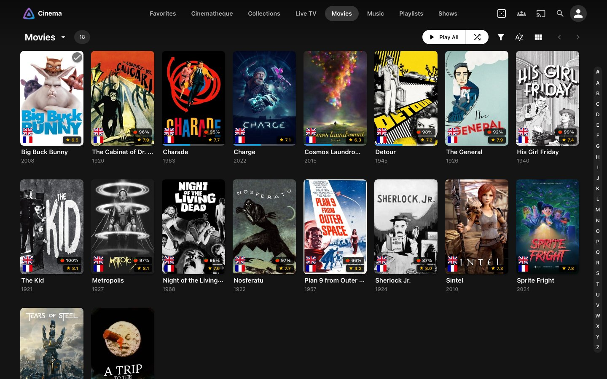
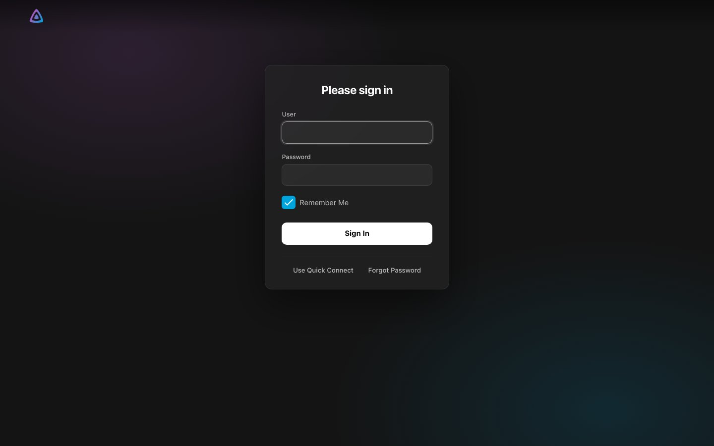
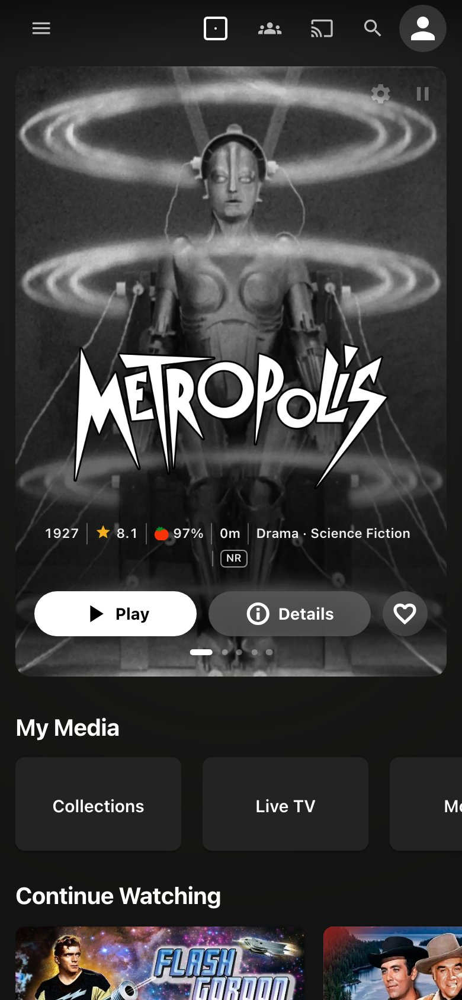
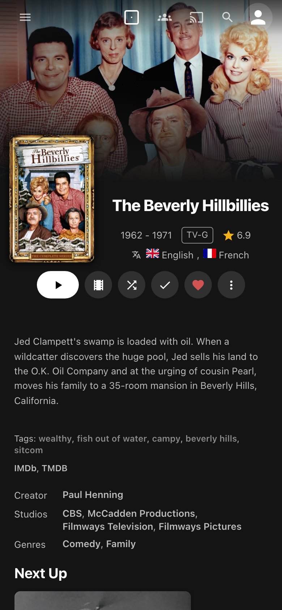

# Cinema

A dark, quiet theme for the modern layout of [Jellyfin](https://jellyfin.org) 12, after the
Netflix and Apple TV apps: a soft black canvas, centred pill navigation, rounded cards, frosted
overlays and Jellyfin's own purple and blue for accents. Pure CSS, no fonts or images fetched.



|                                                |                                           |
| ---------------------------------------------- | ----------------------------------------- |
|    |  |
|  |     |

<p>
  
  
</p>

Screenshots show public domain and Blender Studio films.

## Install

In **Dashboard > Branding > Custom CSS** (for every user) or **Settings > Display > Custom CSS**
(for yourself), paste:

```css
@import url("https://cdn.jsdelivr.net/gh/gauthier-se/jellyfin-theme-cinema@v0.1.0/dist/cinema.min.css");
```

Then save and reload the page. To remove it, clear the field and save.

The URL names a release, so the theme only changes when you change it. Release notes are in
[CHANGELOG.md](CHANGELOG.md).

## Requirements

- **Jellyfin 12.1**, web client.
- **The modern layout**, the default. The legacy desktop and mobile layouts and the TV layout are
  not styled.
- **A recent browser**: Chrome or Edge 105, Firefox 121, Safari 16 or later. The theme relies on
  `:has()` and container queries; its nesting is compiled away at build time.
- Native apps that render their own interface (Swiftfin, Android TV, Findroid) ignore Custom CSS.
  Browsers, Jellyfin Media Player and the Android app load it.

## Add-ons

Plugin support ships as separate files, so a server only loads what it runs. Add the line for each
plugin you have, after the theme's.

**[Media Bar](https://github.com/IAmParadox27/jellyfin-plugin-media-bar)** 3.0: the home slideshow
as an inset card, and the page takes a faint tint of the slide's colours.

```css
@import url("https://cdn.jsdelivr.net/gh/gauthier-se/jellyfin-theme-cinema@v0.1.0/dist/addons/media-bar.min.css");
```

**[Jellyfin Enhanced](https://github.com/n00bcodr/Jellyfin-Enhanced)** 12.x: its card tags step
aside on hover, and its drawer entries line up with the rest.

```css
@import url("https://cdn.jsdelivr.net/gh/gauthier-se/jellyfin-theme-cinema@v0.1.0/dist/addons/jellyfin-enhanced.min.css");
```

**[Cinematheque](https://github.com/gauthier-se/jellyfin-plugin-cinematheque)** 0.3: its tabs,
tiles and inputs in line with the library pages.

```css
@import url("https://cdn.jsdelivr.net/gh/gauthier-se/jellyfin-theme-cinema@v0.1.0/dist/addons/cinematheque.min.css");
```

## Customise

Every colour, radius and size is a `--cn-*` variable, listed with comments in
[src/core/tokens.css](src/core/tokens.css). Override any of them after the import lines:

```css
:root {
  /* A red accent, Netflix style */
  --cn-accent: #e50914;
  --cn-accent-rgb: 229 9 20;
  --cn-gradient: linear-gradient(90deg, #b20710, #e50914);

  /* A darker canvas */
  --cn-bg: #0b0b0d;
  --cn-bg-rgb: 11 11 13;

  /* Squarer corners, larger posters in rows */
  --cn-radius: 4px;
  --cn-card-portrait: clamp(144px, 100px + 6vw, 230px);

  /* Media Bar add-on: a shorter hero, and no tint around it */
  --cn-hero-h: clamp(320px, 52vh, 620px);
  --cn-hero-glow: 0;
}
```

The theme keeps the canvas plain even when **Display > Backdrops** is on: a random film behind
every page fights with the artwork. Item pages still show their own artwork.

## Self-hosting

The jsDelivr link is the simplest install. If you would rather not have every client fetch the
theme from a CDN, download `cinema.css` and the add-ons you need from a
[release](https://github.com/gauthier-se/jellyfin-theme-cinema/releases) and paste their content,
one after the other, into Custom CSS instead of the `@import` lines.

## Known limits

- The dashboard keeps Jellyfin's own look, on purpose.
- The selectors follow jellyfin-web 12.1 and the plugin versions listed under Add-ons. A new
  Jellyfin or plugin release can move class names; the theme is checked against it before a
  release says it supports it.
- Some reverse proxies send a `Content-Security-Policy` that blocks styles from other origins. If
  the theme does not load, either allow `cdn.jsdelivr.net` in `style-src` or self-host it.

## Development

The theme is written in nested, modern CSS under [src/](src) and built into `dist/` with
[Lightning CSS](https://lightningcss.dev), which inlines the parts, flattens the nesting and adds
the vendor prefixes the supported browsers need.

```sh
npm install
npm run server:up      # a throwaway Jellyfin 12.1 in Docker, on 127.0.0.1:8096
npm run server:seed    # films, series, music, Live TV and the add-on plugins
npm run dev            # rebuilds and pushes the theme into that server on each save
```

Then open <http://127.0.0.1:8096>; the credentials are in `test/.data/credentials.json`. See
[CONTRIBUTING.md](CONTRIBUTING.md) for the screenshot checks every change goes through.

## Credits

Inspired by the Netflix and Apple TV web interfaces, and by the Jellyfin themes that came before:
[ElegantFin](https://github.com/lscambo13/ElegantFin), for its add-on files and pinned releases;
[Ultrachromic](https://github.com/CTalvio/Ultrachromic) and
[JellySkin](https://github.com/prayag17/JellySkin), for their modular imports and build steps.

## License

[MIT](LICENSE)
